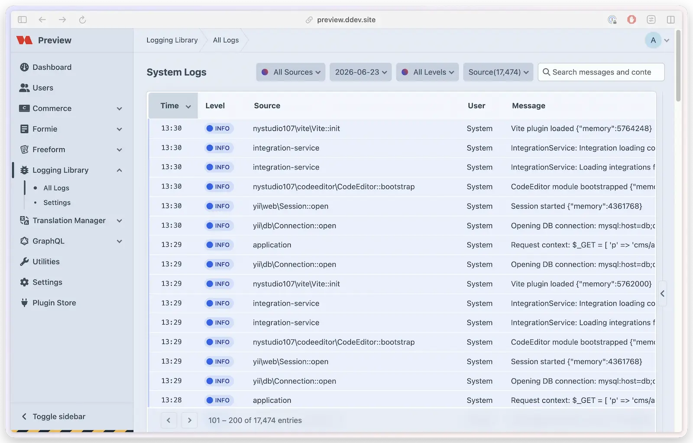

# Log Viewer

The built-in log viewer provides a web interface for browsing, filtering, searching, and downloading log files — directly within each plugin's Control Panel section.



## How It Works

When a plugin calls `LoggingLibrary::configure()`, the log viewer becomes available at `your-plugin/logs/system` unless the viewer is explicitly disabled or the environment is detected as edge/ephemeral. CP routes are registered automatically when the viewer is enabled — no manual route registration is needed. The viewer reads parsed log entries from the [cache](caching.md) and renders them in a paginated table.

## Features

- **Date Selection** — pick a specific log file by date from the available files
- **Level Filtering** — filter by Error, Warning, Info, or Debug
- **Full-Text Search** — search across messages and context data
- **Sorting** — sort by timestamp, level, user, category, or message
- **Pagination** — configurable entries per page. Per-plugin viewers default to 50 (set via `configure()`); the standalone All Logs viewer uses the **Items Per Page** setting on the Interface settings page (default 100)
- **Download** — download the raw log file (permission-gated)
- **Refresh Cache** — clear the parsed cache for the selected log file from the sidebar
- **Context Expansion** — click to view JSON context data inline
- **Consolidated Sources** — the standalone All Logs view groups Craft system logs and plugin logs in the source filter
- **Adaptive Timestamps** — dated log files show time-only rows, while undated/current files such as `phperrors.log` show full date and time
- **Smart Columns** — columns with no variance (e.g., all entries from the same user) are automatically hidden

Full dates shown for undated/current files use the shared date settings from `config/lindemannrock-base.php`; Logging Library's own settings only expose time format and seconds controls.

## Enabling the Viewer

Two things are required for the log viewer to work:

### 1. Enable in Configuration

```php
LoggingLibrary::configure([
    'pluginHandle' => $this->handle,
    // ...
]);
```

Omit `enableLogViewer` to use the default behavior: enabled on normal file-backed environments and disabled on detected edge/ephemeral platforms. Set `enableLogViewer` explicitly when you want to force-enable or force-disable the viewer for that plugin.

### 2. Set Permissions (Optional)

```php
LoggingLibrary::configure([
    'pluginHandle' => $this->handle,
    'viewSystemLogsPermissions' => ['yourPlugin:viewLogs'],
    'downloadSystemLogsPermissions' => ['yourPlugin:downloadLogs'],
]);
```

When `viewSystemLogsPermissions` is empty, any logged-in user can view logs. When `downloadSystemLogsPermissions` is empty, the download button is hidden.

## Viewer Filters

| Filter | Options | Description |
|--------|---------|-------------|
| Level | All Levels, Error, Warning, Info, Debug | Filter entries by log level |
| Source | All Sources, System, Plugins | Filter the standalone All Logs view by log source |
| Category | Categories found in selected Craft channel files | Filter web, queue, and console files by parsed log category, such as `application`, plugin handles, or class names |
| Search | Free text | Case-insensitive search across message and context |
| Sort | timestamp, level, user, category, message | Column to sort by |
| Direction | asc, desc | Sort direction (default: desc — newest first) |

## Log File Format

Plugin log files follow this format:

```
2025-01-15 14:30:25 [user:1][INFO][your-plugin] User exported translations | {"count":45,"format":"csv"}
2025-01-15 14:30:30 [][ERROR][your-plugin] Export failed | {"error":"File not writable"}
```

| Field | Description |
|-------|-------------|
| Timestamp | `YYYY-MM-DD HH:MM:SS` |
| User | `user:{id}` or empty for system/anonymous |
| Level | `DEBUG`, `INFO`, `WARNING`, `ERROR` |
| Category | Plugin handle |
| Message | The log message |
| Context | Optional JSON data (appended after the message) |

The consolidated viewer also recognizes Craft web/queue logs, common third-party plugin log lines that use a single bracketed level, and Monolog's bracketed ISO-8601 format, for example `[2026-06-23T10:02:56.653489+01:00] notification.INFO: Message`. Undated source files such as `freeform-email.log` appear as their own source and use `current` in the file selector. Multi-line entries keep the first line in the table and show the remaining content in the expandable context row.

## Limitations

- The viewer reads from file-based logs only — it does not query a database
- The viewer does not query hosted log feeds or external logging platforms such as Servd, Papertrail, or Datadog
- Large files (100 MB+) may take longer on first load before the cache is built
- On edge/CDN platforms, the viewer is automatically disabled (see [Edge Detection](edge-detection.md))
