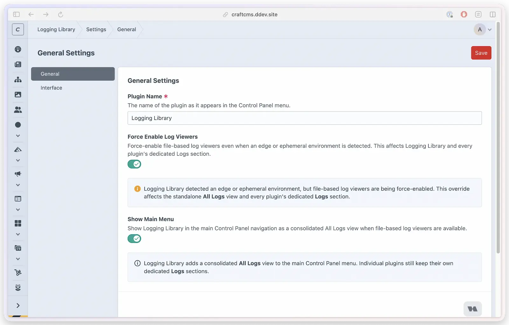

# Settings

Logging Library has its own settings area in the Control Panel for the things that aren't tied to a single plugin's integration — the display name, whether the consolidated viewer appears in the main menu, how many entries the standalone viewer shows per page, and how timestamps are formatted. Per-plugin logging behaviour (log level, retention, per-plugin permissions) is still configured in code with [`LoggingLibrary::configure()`](configuration-options.md); this page covers the library's *own* settings.



## Where to find it

When the Logging Library main item is visible, go to **Logging Library → Settings**. You can always reach the plugin settings through Craft's **Settings → Plugins → Logging Library** area when authorized. Settings open on the **General** tab, with **Interface** as a second tab when the standalone file viewer is surfaced. Access requires the `loggingLibrary:manageSettings` permission (admins always have it) — see [Permissions](../developers/permissions.md).

> [!NOTE]
> The main **Logging Library** navigation item is absent when **Show Main Menu** is off. It is also absent when both file viewers and Runtime Logs are unavailable. If Runtime Logs are enabled while file viewers are suppressed, the main item can remain with **Runtime Logs** instead of **All Logs**. An authorized direct request to the Logging Library root may redirect to Settings; that route behaviour does not create a visible main navigation item. The **Interface** tab is hidden whenever the standalone file viewer is not surfaced.

## General

| Setting | What it does | Default |
|---------|--------------|---------|
| **Plugin Name** | The display name shown for Logging Library in the Control Panel. | `Logging Library` |
| **Show Main Menu** | Allow Logging Library in the main Control Panel navigation when at least one viewer family is available. Turn it off to remove the main item while keeping each plugin's own **Logs** section. | On |
| **Force Enable Log Viewers** | Only shown when Craft reports an ephemeral host or Servd is detected. Restores automatic file-viewer availability for the standalone **All Logs** view and plugin integrations; an explicit per-plugin `enableLogViewer` value still wins. | Off |

**Force Enable Log Viewers** is the escape hatch for the [edge-detection](edge-detection.md) behaviour. Craft's `App::isEphemeral()` signal and Servd detection compose with OR behavior. Servd is detected when Craft's normalized `SERVD_PROJECT_SLUG` value resolves to a non-empty project slug; missing, blank, whitespace-only, null, and normalized false values do not enable Servd detection. If you've attached persistent shared storage at `storage/logs/`, switch this on to restore the automatic viewer default. A plugin that explicitly configures `enableLogViewer` keeps that explicit value.

This setting does not import hosted logs from Craft Cloud, Servd, or any external logging platform. It only tells Logging Library to try reading local files again. It does not change Craft/Yii logging, dedicated Monolog targets, or log destinations.

## Interface

The Interface tab only appears when a viewer is available (see the note above).

| Setting | What it does | Default |
|---------|--------------|---------|
| **Items Per Page** | How many entries the standalone **All Logs** and **Runtime Logs** viewers show per page (10–500). | 100 |
| **Time Format** | 12-hour (AM/PM) or 24-hour clock for log timestamps. | Inherits base |
| **Show Seconds** | Whether timestamps include seconds. | Inherits base |

**Items Per Page** applies to Logging Library's own views — the standalone **All Logs** viewer and [Runtime Logs](runtime-logs.md). Each plugin's own viewer uses the `itemsPerPage` it passes to `configure()` (default 50) — see [Configuration Options](configuration-options.md).

**Time Format** and **Show Seconds** cascade from the base plugin when their Control Panel fields are set to **Use global default**. Selecting a value here overrides the base default. Only the matching key in `config/logging-library.php` locks a field on this page. The remaining date settings (month format, date order, separator) are global — they live only in the base config, not on this page. See [Log viewer → Adaptive Timestamps](log-viewer.md) for how timestamps render.

## Overriding settings from a config file

Every setting on these pages can be locked in code with a `config/logging-library.php` file. Copy the sample from the plugin's `src/config.php` and edit your copy:

```php
<?php
return [
    '*' => [
        'pluginName' => 'Logging Library',

        // Entries per page in the standalone viewer (10–500)
        'itemsPerPage' => 100,

        // Show Logging Library in the main CP navigation
        'showCpSection' => true,

        // Force-enable file-based viewers even on edge/ephemeral hosting
        'forceEnableLogViewer' => false,

        // Cache-backed recent runtime log store (config-only, no CP fields)
        // — see the Runtime Logs page for the full option reference
        'runtimeLogStore' => [
            'enabled' => false,
            'skipConsoleRequests' => true,
            'skipQueueRequests' => true,
            'redis' => [
                // 'database' => '$LOGGING_LIBRARY_RUNTIME_REDIS_DB',
            ],
        ],

        // Base-plugin time overrides (optional — leave out to inherit base)
        // 'timeFormat'  => '24',  // '12' or '24'
        // 'showSeconds' => false,
    ],
];
```

The `runtimeLogStore` block configures the [Runtime Logs](runtime-logs.md) view. Unlike the settings above, it has no Control Panel equivalent — it's config-file only and remains disabled until `runtimeLogStore.enabled` is set to `true`. It is governed independently from file-viewer detection and **Force Enable Log Viewers**. Its conservative defaults skip runtime capture for console requests and detected queue execution. The optional nested `redis.database` setting can inherit Craft's Redis database, select an assigned non-negative database, resolve an environment reference, or explicitly disable `SELECT`; the Runtime Logs page documents the strict resolution rules. Restart long-running queue workers after changing this block because existing targets retain their startup configuration.

When a setting is present in this file, the matching Control Panel field is **disabled** and shows a notice that it's being overridden by `config/logging-library.php`. The full resolution order, highest priority first:

1. **Plugin config file** (`config/logging-library.php`) — environment-aware overrides
2. **Control Panel setting** — what's saved on these pages
3. **Base config file** (`config/lindemannrock-base.php`) — global default (time settings only)
4. **Hardcoded defaults** — the final fallback

Use the config file when you want a value pinned per environment (for example, forcing viewers on in one environment only) or kept out of the database; use the Control Panel for everything else.

## Where settings are stored

These settings persist in the plugin's own database table (`logginglibrary_settings`), not in Craft's project config. The table is created on install and kept current by the plugin's migrations, so existing sites pick up new settings automatically on update.
