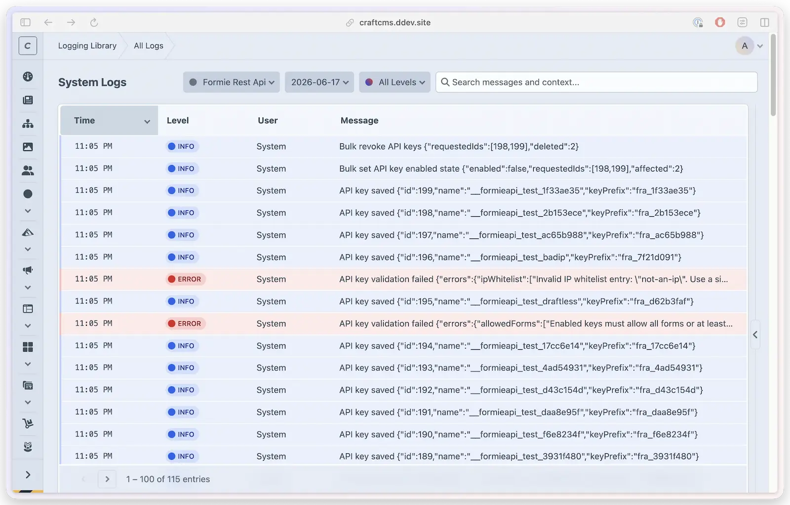

# Standalone System Log Viewer

The standalone viewer provides a centralized interface for browsing all log files in `storage/logs/` — plugin logs, Craft logs, and PHP error logs — from a single page.



## Accessing the Viewer

When it's surfaced in the main navigation, the standalone viewer lives at **Control Panel → Logging Library → All Logs**.

The main-menu item appears only when **both** of these are true:

- **Show Main Menu** is on in [Settings → General](settings.md), and
- at least one log view is available: a file-based viewer (you're not on a detected edge/ephemeral environment, or **Force Enable Log Viewers** overrides it — see [Edge Detection](edge-detection.md)), or the [runtime log store](runtime-logs.md) is enabled.

The **All Logs** subnav item itself still requires a file-based viewer; when only the runtime store is enabled (for example, on an edge environment), the menu shows **Runtime Logs** instead.

If **Show Main Menu** is off, the main **Logging Library** item opens to Settings instead, and the viewer is no longer linked from the navigation — but the page itself remains reachable at `/admin/logging-library/logs/system` for anyone with the `loggingLibrary:viewAllLogs` permission. On an edge/ephemeral environment with no override, file-based viewers are hidden entirely.

## Source Filtering

The viewer automatically groups log files by source and provides a dropdown filter:

| Source | Files Matched | Description |
|--------|---------------|-------------|
| Web | `web.log`, `web-YYYY-MM-DD.log` | Craft CMS web request logs |
| Console | `console.log`, `console-YYYY-MM-DD.log` | CLI and console command logs |
| Queue | `queue.log`, `queue-YYYY-MM-DD.log` | Queue job logs |
| PHP Errors | `phperrors.log` | PHP error log |
| *Plugin name* | `plugin-handle-YYYY-MM-DD.log` | Logs from plugins using Logging Library |
| Other | Anything else | Unrecognized log file patterns |

## Multi-Format Parsing

The viewer automatically detects the format of each log line and parses it accordingly:

**Plugin format** (from Logging Library):
```
2025-11-01 14:30:25 [user:1][INFO][plugin-handle] Message | {"context":"data"}
```

**Craft CMS format**:
```
2025-11-01 14:30:25 [web.INFO] [yii\db\Connection::open] Message {"memory":962008}
```

**PHP error format**:
```
[01-Nov-2025 14:30:25 UTC] PHP Warning: message in /path/file.php on line 123
```

Format detection uses the `LoggingLibrary::detectLogFormat()` method, which checks the first few characters of each line against known patterns.

## Workflow

1. **Select a source** — use the source dropdown to filter by Web, Console, Queue, PHP Errors, or a specific plugin
2. **Select a file** — click on a file in the sidebar to load its entries
3. **Filter and search** — use level filter and search box to narrow down entries
4. **Download** — download the raw file if you have the `loggingLibrary:downloadAllLogs` permission

## Permissions

The standalone viewer is gated behind its own permissions (separate from per-plugin log permissions):

| Permission | Description |
|------------|-------------|
| `loggingLibrary:viewAllLogs` | Access the standalone viewer |
| `loggingLibrary:downloadAllLogs` | Download log files from the standalone viewer |

Admins always have access regardless of permission settings.

## Limitations

- The standalone viewer is read-only — you cannot delete log files from the interface
- It reads files from Craft's `storage/logs/` path only; it does not query hosted log feeds or external logging platforms
- Files smaller than 10 bytes are automatically excluded (likely empty)
- On edge/CDN platforms, file-based logs may not be available (see [Edge Detection](edge-detection.md))
