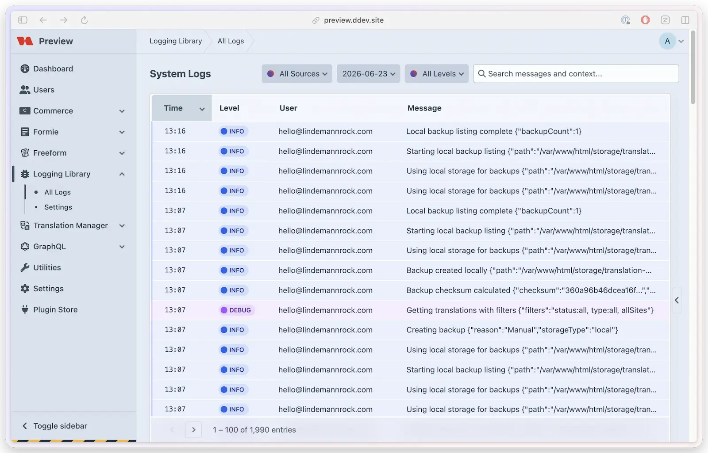

# Quickstart

Get Logging Library running in under 5 minutes. By the end of this guide you'll have dedicated log files and a built-in log viewer for your plugin.

## Before you start

Install [Logging Library](installation.md) first.

## 1. Add the trait and configure logging

In your plugin's main class, add `LoggingTrait` and call `LoggingLibrary::configure()`:

```php
use lindemannrock\logginglibrary\traits\LoggingTrait;
use lindemannrock\logginglibrary\LoggingLibrary;

class YourPlugin extends Plugin
{
    use LoggingTrait;

    public function init(): void
    {
        parent::init();

        LoggingLibrary::configure([
            'pluginHandle' => $this->handle,
            'pluginName' => $this->name,
            'logLevel' => 'info',
            'viewSystemLogsPermissions' => ['yourPlugin:viewLogs'],
            'downloadSystemLogsPermissions' => ['yourPlugin:downloadLogs'],
        ]);
    }
}
```

## 2. Log your first message

In any service or controller that uses the trait:

```php
$this->logInfo('Export completed', ['count' => 42]);
```

## 3. Verify it works

Navigate to **Logging Library → All Logs** in the Control Panel. If the Logging Library CP section has been hidden in plugin settings, open the standalone viewer directly at `/admin/logging-library/logs/system` instead. Select today's log file for your plugin — you should see the log entry you just created.



The file-based viewer is enabled by default on normal file-backed environments. On detected edge/ephemeral platforms such as Servd, it is hidden unless you explicitly [force-enable it](../feature-tour/settings.md). Force-enabling only retries local file reading; it does not connect the viewer to Servd's hosted log feed.

## What's next

- [Configuration Options](../feature-tour/configuration-options.md) — all available `configure()` parameters
- [Feature Tour](../feature-tour/overview.md) — explore everything Logging Library can do
- [Integration Guide](../feature-tour/integration-guide.md) — full setup with routes, nav, and permissions
