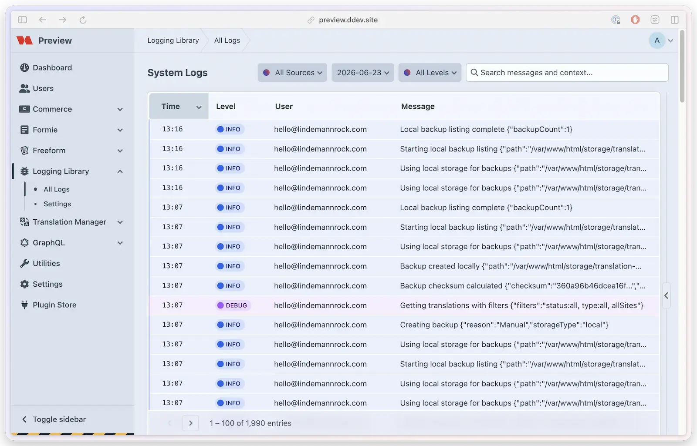

# Quickstart

Connect Logging Library to a plugin and confirm your first dedicated log entry in the Control Panel.

## Before you start

Install Logging Library and complete its [post-install setup](installation.md#post-install-setup) first.

## 1. Add the trait and configure logging

In your plugin's main class, add `LoggingTrait` and call `LoggingLibrary::configure()`:

```php
use craft\base\Plugin;
use lindemannrock\logginglibrary\traits\LoggingTrait;
use lindemannrock\logginglibrary\LoggingLibrary;

class YourPlugin extends Plugin
{
    use LoggingTrait;

    public function init(): void
    {
        parent::init();

        LoggingLibrary::configure([
            'pluginHandle' => $this->handle,
            'pluginName' => $this->name,
            'logLevel' => 'info',
            'viewSystemLogsPermissions' => ['yourPlugin:viewLogs'],
            'downloadSystemLogsPermissions' => ['yourPlugin:downloadLogs'],
        ]);
    }
}
```

## 2. Log your first message

In any service or controller that uses the trait:

```php
$this->logInfo('Export completed', ['count' => 42]);
```

## 3. Verify it works

Navigate to **Logging Library → All Logs** in the Control Panel. If **Show Main Menu** is off on a durable host, there is no main navigation item, but an authorized user can still open the standalone viewer directly at `/admin/logging-library/logs/system`. Select today's log file for your plugin — you should see the log entry you just created.



The file-based viewer is enabled by default on durable hosts. Craft's ephemeral-host signal and Servd detection compose with OR behavior. Servd is detected when Craft's normalized `SERVD_PROJECT_SLUG` value resolves to a non-empty project slug; missing, blank, whitespace-only, null, and normalized false values do not enable Servd detection. Either detected signal hides automatic file viewers unless you explicitly [force-enable them](../feature-tour/settings.md). This affects viewers only: Craft/Yii logging and dedicated Monolog targets keep running, and force-enabling only retries local file reading rather than connecting to a hosted log feed.

For a CP view that does not depend on files, enable [Runtime Logs](../feature-tour/runtime-logs.md) in **Logging Library → Settings → Runtime Logs**, or through `config/logging-library.php`. It remains opt-in and can be the only Logging Library view shown on an ephemeral host.

## What's next

- [Configuration options](../feature-tour/configuration-options.md) — all available `configure()` parameters
- [Feature tour](../feature-tour/overview.md) — explore everything Logging Library can do
- [Integration guide](../feature-tour/integration-guide.md) — full setup with routes, nav, and permissions
